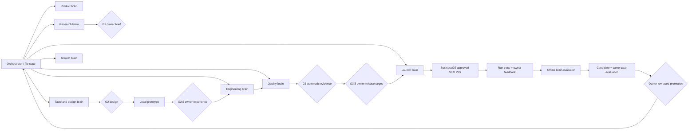

# UIBuilder Brain and staged website pipeline

This is the implementation map for the approved plan, the supplied Website Build/Launch Playbook, domain checklist, video set and Screenshot Research Catalog. The single source of truth remains `AGENTS.md`, `plan/PROGRESS.md` and the project's `docs/` files.
For the exact skill/plugin/hook inventory and scenario-to-tool routing, see [Tool and Skill Routing](TOOL_AND_SKILL_ROUTING.md).

## How the owner's source files changed the plan

| Input | Incorporated into | Remaining boundary |
|---|---|---|
| `Website_Build_Launch_Playbook (3).md` | Product scope and acceptance, staged UX/build/QA/SEO/launch checks in `AGENTS.md`, `brain/domains.json` and the phase plans | SaaS auth, payments and CRM apply only to recipes that need them; they are not portfolio work |
| `domain_launch_checklist.pdf` | `plan/DOMAIN-LAUNCH.md` and the `domain-ops` role for registrar, DNS, TLS, canonical, mail authentication and verification | Domain purchase and live DNS await separate owner approval |
| `Screenshot_Research_Catalog (2).md` | `docs/SCREENSHOT_CATALOG_TRIAGE.md` and selected Brain entries for Mobbin, Anime.js, OpenSEO, Agent Browser and other relevant tools | Screenshot claims and individual component rights remain unverified until primary-source review |
| 16 MP4s in `D:\PHOTO\new\video` | Timecoded observations in the portfolio `TASTE_REPORT.md` and three original experience briefs | Recorded demos do not prove source-site interaction behavior or reuse rights |
| TypeSafe Jev links and key | `docs/JEV_RESEARCH.md`, ignored `.env`, bounded adapter/eval and optional router entry | Six synthetic cases are only a smoke test; no automatic dispatch or SEO edit |
| `vercel-labs/agent-browser` | Installed CLI/Chrome/project skill and browser router entry | Exploratory browser work; Playwright remains the formal cross-browser gate |
| Owner's self-improvement brief | `brain/learning/`, `scripts/improve.mjs`, `brain-evaluator`, `/improve`, and the measured loop specification | Active router stays at v1 until real outcomes and exact owner review support promotion |

## How a request is routed

1. Orchestrator reads `docs/STATE.md`, `brain/domains.json`, the pipeline recipe and owner preferences. Stage rules select the responsible agent and required output files.
2. `scripts/recommend-resources.mjs <domain> <task>` lists `ready` resources and a separate `review` queue. `ready` requires APPROVED/TRUSTED trust, suitable domain/task match, and verified code-reuse rights when code is involved. The tool router in `brain/tools.json` decides whether an optional CLI/API is actually available. Agents record why each source was chosen and what mechanism was extracted.
3. Jev can make a narrow shadow-mode semantic suggestion for ambiguous routing or internal-link relevance. The API receives only an explicit public text file. Code retains stage order, candidate list, trust, rights, acceptance, gates and execution. Six synthetic cases passed; real-world evaluation is still needed.
4. A specialist writes its owned artifacts and `docs/handoff/<agent>.json`, with a redacted run ID. The next agent reads files, never chat memory. `/learn` records owner feedback and design lineage after the build. The offline `brain-evaluator` clusters observed failures, evaluates bounded candidates and monitors promoted versions. See [the measured learning loop](SELF_IMPROVING_BRAIN.md).

## Domain responsibilities and tools

| Domain | Agent owner | Typical resources and tools | Decision boundary |
|---|---|---|---|
| Product | Orchestrator, product-manager | Brief, acceptance, priorities | Owner G1 |
| Research | research | Official sites, competitors, ≤5 references, Agent Reach only for public media | Trust and source rights |
| Taste/design | taste-research, ux, design-director | Local video storyboard, live browser, original interaction brief, frontend/taste skills | Owner G2 and G2.5 |
| Engineering | frontend, backend | Golden stack, licensed components, original code | DESIGN.md and acceptance |
| Quality | ship | Playwright G3 matrix, axe, Lighthouse, dependency/secret/security scans; Agent Browser for exploratory snapshots | Automatic G3 with retained evidence |
| Growth | growth | SEO data files, route graph, deterministic link audit; Jev relevance only as advisory | `seo.manifest.json` and owner-reviewed PRs |
| Launch | ship, domain-ops | Preview/host, DNS/TLS/mail, video, BusinessOS connection | Owner G3.5 plus separate DNS approval |
| Learning | brain-evaluator, Orchestrator | Run/feedback records, failure diagnosis, held-out selector cases, versioned router JSON | Exact owner review for promotion; no gate or deployment authority |

## Taste and source-use loop

The taste agent collects references, samples video frames with timecodes, verifies live behavior where possible, then separates a mechanism from its assets and code. It writes 2–3 original options with performance, accessibility and rights notes. The design council turns those into a coherent system; the owner sees a local interactive prototype at G2.5. Only then does frontend implement it. Components from licensed galleries can be used only within their license and with dependency/asset checks. Lightswind is inspiration only for UIBuilder. The local portfolio's Evidence Atlas study applies this loop; site-specific files are intentionally absent from this public harness repository.

## How quality and approval work

G1 approves scope/wireframes. G2 approves the visual system. G2.5 approves an exact experience artifact before build. G3 executes the complete quality contract and records results. G3.5 approves the final local build and exact external target before a preview or production deploy. Approval JSON files contain SHA-256 hashes of the reviewed artifacts. A changed file invalidates the approval. DNS purchase/changes and BusinessOS publish still require their own approval. Agent Browser 0.38.1, Chrome 154 and its project skill are installed for exploration; its CLI skill calls for a named session and accessibility snapshots. Playwright remains the cross-browser G3 runner.

## Near-term completion work

1. Gather owner feedback on the Evidence Atlas options and amend locked design files only for the selected direction.
2. Use the timecoded source ledger in `D:\UiBuildProj\portfolio\docs/TASTE_REPORT.md`; test any identified live sites at desktop/mobile before promotion from REVIEWED.
3. Restore the portfolio's missing `docs/G3_EVIDENCE.json`, rerun the formal gate on final source, and address any failure. The earlier separate test results are useful evidence, but the formal gate is pending.
4. Prepare `RELEASE_REVIEW.md` with exact target and local walkthrough, then seek G3.5 approval. No new external deploy before it.
5. Evaluate Jev on representative labeled real tasks/link pairs before changing it from shadow mode. Keep Agent Reach optional; install only if it beats current public-source research flow.
