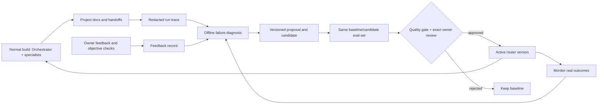

# UIBuilder's measured improvement loop

Status: **instrumented for improvement**. The local loop works, but there are not yet enough trustworthy, comparable project outcomes to claim that the agents improve over time. Portfolio implementation and release remain on hold while the harness is completed.

## Where learning lives



The normal recommendation command only reads `brain/learning/active.json` and its immutable JSON version. Diagnosis and evaluation run separately through `scripts/improve.mjs`; they never sit in the visitor-facing site or in a normal agent's critical path. `UIBUILDER_LEARNING=0` forces the original `router-v1` behavior. The Brain's trust, rights, tool allowlists, owner gates and deployment rules are outside the candidate surface.

## Current agent and failure map

UIBuilder's users are the site owner and client teams. Inputs are briefs, source links, project docs, verified assets and owner feedback. Outputs are premium sites, test reports, SEO data, launch artifacts and BusinessOS handoffs. The Orchestrator follows `.claude/commands/build.md` and `AGENTS.md`; 11 specialist agents own named files and handoffs. Claude Code uses Anthropic models for its agent definitions; Codex can follow the same file contract with OpenAI models. No single model is pinned by this repository, and TypeSafe Jev is an optional shadow classifier. `brain/resources.json` and `brain/patterns/` are curated retrieval material; `brain/preferences.md` and `brain/builds/` hold owner taste and lineage. `brain/domains.json` and `brain/tools.json` route work; G1/G2/G2.5/G3/G3.5 constrain release. Personal portfolios may use Vercel Hobby; commercial sites use client-owned Cloudflare Workers. See [the broader architecture](BRAIN_ARCHITECTURE.md).

| Failure category | Evidence today | Smallest update surface | Primary metric |
|---|---|---|---|
| `routing_miss` | Resource selector can surface irrelevant substring matches in review; curated fixture `target_form_word_collision` | JSON ranking version, then catalog aliases if real examples support them | Labeled relevant resources in top 5; unrelated resources in review |
| `evidence_quality` | Source rights and live behavior are often unverified; video clips are only visual samples | Research checklist, provenance and retrieval data | Verified source/rights coverage; owner acceptance |
| `tool_failure` / `policy_violation` | Agent/browser/model tools can fail or exceed a role's allowlist | Tool routing descriptions and fallback procedure; deterministic policy remains fixed | Tool error/violation counts and recovery latency |
| `gate_failure` | Current portfolio formal G3 evidence file is missing; an earlier preview used the wrong target before correction | Gate workflow and evidence capture | Required evidence complete; zero unauthorized deployments |
| `rights_block` | Component-gallery licenses and subdependencies differ | Resource trust/rights review by owner, never model score alone | Zero unlicensed code/assets used |
| `performance` | An earlier Next fallback exceeded mobile LCP; static candidate was faster | Performance workflow and implementation, evaluated per route | LCP, CLS, Lighthouse, build time |
| `owner_rejection` | Portfolio experience choice and owner rating are pending | Taste memory and design workflow after explicit feedback | Owner acceptance and repeated generic-design complaints |

Run records include stable UUID, agent/project/config version, input/output/evidence references, router tool IDs and statuses, errors, measured latency/tokens/cost (or `null`), outcome signals and failure categories. The CLI derives tool-policy and tool-error signals. It rejects unknown fields, unsafe references and missing evidence paths; it does not copy raw prompts, page text, client data, video or credentials. Feedback is a separate immutable record tied to a run. `diagnose` counts unique failed run IDs per category and retains those IDs for inspection.

## Why this mechanism

[Reflexion](https://arxiv.org/abs/2303.11366) shows a feedback-and-memory approach without model-weight changes. [DSPy](https://arxiv.org/abs/2310.03714) and its [optimizer documentation](https://dspy.ai/3.0.0/learn/optimization/optimizers/) show that prompts/examples can be optimized against an explicit metric, but require a reliable dataset. [Voyager](https://arxiv.org/abs/2305.16291) illustrates a growing skill library with execution feedback in a very different environment. [Anthropic's agent-evaluation guide](https://www.anthropic.com/engineering/demystifying-evals-for-ai-agents) emphasizes multiple graders, production monitoring and human review. [OWASP's prompt-injection guidance](https://cheatsheetseries.owasp.org/cheatsheets/LLM_Prompt_Injection_Prevention_Cheat_Sheet.html) motivates keeping retrieved documents and tool output outside policy authority.

For UIBuilder, a small local JSON version plus held-out cases is cheaper and more controllable than installing DSPy or training a model. `/learn` stores verified taste and build memory; it no longer changes trust from a rating alone. Repeated failure can suggest a prompt, skill or retrieval change later, but V1 promotion supports **resource-ranking config only**. Any wider surface needs its own evaluator and explicit policy decision. Jev stays advisory and is not its own grader.

## Operating commands

Run from the repository root. Create a trace JSON shaped like [`brain/learning/examples/run.json`](../brain/learning/examples/run.json), replacing example paths with existing project files and using actual router tool IDs. Missing telemetry is `null`.

```powershell
node scripts/improve.mjs record path/to/run.json
node scripts/improve.mjs feedback RUN_ID path/to/feedback.json
node scripts/improve.mjs diagnose
node scripts/improve.mjs monitor
```

Feedback shape is in [`brain/learning/examples/feedback.json`](../brain/learning/examples/feedback.json). Save an owner verdict in a project doc first and reference that file. The CLI deliberately has no free-form feedback text field: the project doc carries the context, and the record carries only the category, rating and reference.

After inspecting a category's run IDs, write one bounded candidate under `brain/learning/candidates/` and a proposal spec like [`proposal-spec.json`](../brain/learning/examples/proposal-spec.json). Keep evaluation cases separate from those source runs. The evaluator accepts target, unrelated regression and decline cases; its V1 set is [`resource-routing-v1.json`](../brain/learning/evals/resource-routing-v1.json).

```powershell
node scripts/improve.mjs propose routing_miss brain/learning/candidates/router-v2-token-match.json brain/learning/examples/proposal-spec.json
node scripts/improve.mjs evaluate brain/learning/candidates/router-v2-token-match.json brain/learning/evals/resource-routing-v1.json
```

`propose` requires at least one observed failed run. It records the exact candidate SHA-256, supporting run IDs, expected benefit, regression risk and rollback. `evaluate` stores both versions' per-case results, latency and cost. Promotion requires all decline cases to pass, no previously passing case to regress, and at least one case to improve. A fixture gate pass is only a technical prerequisite.

For promotion, the owner reviews the proposal and evaluation report, then creates a JSON file with `action: "promote"`, `proposal_id`, `candidate_sha256`, `evaluation_sha256` (hash of the complete evaluation report file), `reviewer: "owner"` and `approved_at` ISO timestamp. The CLI does not create this file. It checks the active baseline, candidate bytes and eval-set bytes again before switching the pointer. The record is an audit receipt, not cryptographic proof of human identity; repository permissions and owner review remain necessary.

```powershell
node scripts/improve.mjs promote PROPOSAL_ID EVALUATION_ID path/to/owner-approval.json
node scripts/improve.mjs monitor
```

Rollback uses a separate owner file with `action: "rollback"`, `target_version`, `target_sha256`, `reviewer: "owner"`, and `approved_at`. Then run `node scripts/improve.mjs rollback router-v1 path/to/rollback-approval.json`. For an immediate local diagnostic, set `UIBUILDER_LEARNING=0`; this bypasses the active pointer without changing stored versions.

## Baseline and candidate evidence

`node scripts/improve.mjs evaluate brain/learning/candidates/router-v2-token-match.json brain/learning/evals/resource-routing-v1.json` produced [`evaluation d0b1e1fa`](../brain/learning/evaluations/d0b1e1fa-6d27-4612-a0fd-83e6986c7f4f.json): baseline `router-v1` **8/9**, candidate **9/9**, zero fixture regressions, target 1/2 → 2/2, unrelated regression 4/4 → 4/4, decline 3/3 → 3/3. The deterministic selector made no paid API calls; measured local total evaluation time was 23.398 ms baseline and 4.534 ms candidate in that single run. Those times are noisy and do not establish a speedup. The changed case removes an unrelated animation guide from an engineering form-task review shortlist. The candidate remains **unpromoted** because no real owner-labeled routing failure corpus exists.

The next valuable experiment is to collect 30–50 real, consented, labeled resource-selection tasks across domains, including cases where the Brain should abstain. Reserve a separate held-out set before revising the candidate; measure top-5 relevance, false-ready rate, human corrections, time and cost. Only then consider owner promotion or a broader prompt/skill update.
