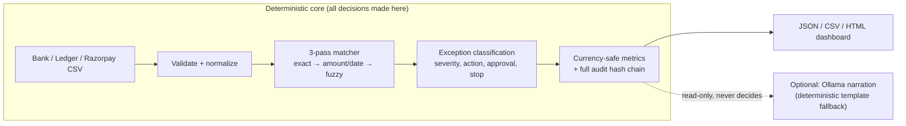

# AI Finance Controller

**Auditable bank, ledger & Razorpay reconciliation** for the Razorpay Buildathon Track 04 — a deterministic 3-pass matcher that reports what it matched, which rule and evidence produced each decision, and an honest, evidenced list of everything it couldn't resolve.

**Proof points** (all reproducible via the commands below, artifacts committed in this repo):

| | |
|---|---|
| Demo batch | 77 records · 62 matched · 15 evidenced exceptions |
| Currency-safe coverage | 94.9% INR record-value coverage (never aggregated across currencies) |
| Scale | 103,049 records · 5.114s median engine time (n=5) · ~20.1k rec/s |
| Sealed benchmark | 234 records, frozen before its first evaluation · strict accuracy / pair F1 / macro-F1 all **1.0** (specification consistency, not real-world accuracy — see below) |



## Quick start

```bash
python -m pip install -r requirements.txt
python main.py --demo --output report.json --dashboard report.html   # two-way: bank <-> ledger
python main.py --three-way-demo --output three_way_report.json       # + razorpay settlement (1:1 and many:1)
python -m pytest -q                                                   # 45/45
```

The demo uses seed `42`, so repeated runs produce the same records and decisions. Runtime matching never reads ground truth; `evaluate.py` scores a report against it offline, after the fact — the matcher never sees it. `--natural` and `--narrate` call a local Ollama model if one is running (default `qwen3:4b-instruct`, override with `--ollama-model`; `ollama pull qwen3:4b-instruct` if you don't have it — any pulled model works); without it, they fall back to deterministic template narration automatically — the CLI works fully either way, and every narrated line discloses which path produced it. Full command reference (held-out evaluation, robustness benchmark, scale benchmark) is below.

## Pipeline

```text
CSV or generated data
  → schema validation
  → normalization
  → duplicate-reference detection
  → exact reference pass
  → amount/date pass
  → fuzzy description pass
  → exception classification (ties resolve to AMBIGUOUS_MATCH, never an arbitrary pick)
  → currency-safe metrics and complete audit trail
  → terminal report, JSON/CSV exports, optional HTML dashboard
```

Matching is deterministic and indexed (reference lookup + amount-sorted range queries, not a full-scan per record). A successful pair removes both records from later candidate pools. If multiple candidates qualify — or if two candidates tie exactly on closest-distance in the final classification pass — the engine leaves the cluster unresolved (`AMBIGUOUS_MATCH`) instead of picking arbitrarily.

`ReconciliationEngine.run()` takes an explicit `source_pair` (default `("bank", "ledger")`) and fails fast — raises, rather than silently dropping records — if given input outside that pair.

## Full command reference

```bash
python main.py --demo --explain bank-032 --natural
python main.py --demo --narrate
python evaluate.py report.json data/ground_truth.json           # conformance fixture, not accuracy evidence

# sealed, specification-derived benchmark: run the held-out corpus through the matcher
# first, THEN evaluate that report against its own truth file -- report.json above is
# the demo batch and shares no record IDs with heldout_v1, so evaluating it against
# heldout_v1's truth is a script error, not a real evaluation.
python main.py --bank data/heldout_v1/bank.csv --ledger data/heldout_v1/ledger.csv --output heldout_report.json
python evaluate.py heldout_report.json data/heldout_v1/truth.json

python scripts/run_multiseed_eval.py --seeds 50 --records 500    # synthetic robustness benchmark
python scripts/benchmark_scale.py                                 # throughput (see scale_benchmark.json)
python main.py --bank bank.csv --ledger ledger.csv --razorpay razorpay.csv --output three_way_report.json
```

## Accuracy evidence: three corpora, none of them confused for real-world data

None of these is "independent accuracy" in the sense of human-reviewed real-world data — that would require a second reviewer this pipeline doesn't have. They're kept separate because they trade off differently between honesty and effort:

- **`data/heldout_v1/`** — a **specification-derived benchmark, frozen (SHA-256-hashed, see `manifest.json`) before its first evaluation** (≥200 records, ≥10 instances per outcome class, ≥5 duplicate clusters, ≥5 ambiguous clusters). Its scenarios and expected labels (`scripts/author_heldout_v1.py`) were derived by direct reasoning about the published tolerance/window formulas, not by running the generator or the matcher, and no rule was tuned against it before that first evaluation. It is **not** independent real-world accuracy evidence — the same person who wrote the matcher also wrote this corpus's expected labels, from the same spec the matcher implements. What it *does* demonstrate: the matcher's actual behavior matches the spec's stated contract on cases the matcher was never literally hard-coded against (unlike `ground_truth.json` below).
- **`data/ground_truth.json`** (from `--demo`) — a fixed conformance fixture with hand-planted per-category counts, used for regression tests and the demo walkthrough. Its numbers are **not** accuracy evidence of any kind — the matcher's exact tolerances were built and tuned against this exact fixture.
- **`scripts/run_multiseed_eval.py`** — a *synthetic robustness benchmark*: 50 seeds × 500 procedurally-generated records with occasional deliberate cross-case noise, reporting mean ± stdev accuracy. Measures robustness under randomized conditions, not accuracy against any external standard.

`evaluate.py` reports, for whichever corpus it's pointed at: strict record accuracy (status + label + counterpart all correct), label-only accuracy (diagnostic), reciprocal-pair precision/recall/F1 (a predicted pair counts only if both sides point back at each other — a wrong or non-reciprocal counterpart is a false positive, not a pass), per-label precision/recall/F1/support with an `insufficient_support` flag below 8 samples, macro-F1, and a confusion matrix. The evaluation denominator is always every truth record — a report that omits a decision for a truth record is scored as wrong for it, never silently excluded; `missing_decisions`/`unexpected_decisions` in the output surface exactly that (including, notably, evaluating the wrong report against the wrong truth file — that fails loudly now, not as a silent zero-record no-op).

## Throughput

`scripts/benchmark_scale.py`'s output is committed at `scale_benchmark.json` — cite that artifact, not `report.json`'s `processing_time_ms` (a single-run, unwarmed number on whatever batch happened to run). Its `environment` block records the exact platform/processor/Python version, and each size's `sample_size`/`p95_reliable` fields say plainly when there weren't enough runs for a trustworthy p95: by default the script scales repeat count down for sizes above 10,000 records to keep total runtime reasonable (the committed artifact's 100k tier ran only 5 samples, so its `p95_ms` is `null`, not a fabricated number) — pass a larger `--repeats` to raise every tier's sample count, at the cost of a multi-minute run.

## Reported metrics

- `record_match_rate = matched_records / eligible_records`
- `pair_match_rate = matched_pairs / min(bank_records, ledger_records)`
- Per-currency monetary metrics under `summary.monetary_metrics[CURRENCY]` — **never aggregated across currencies** (Decimal/minor-unit arithmetic):
  - `record_value_coverage_rate` — both-sides matched value / both-sides gross value
  - `economic_cash_coverage_rate` — bank-side matched value / bank-side gross value (avoids double-counting one economic event booked on both sides)
  - `matched_record_value + unresolved_record_value == gross_record_value` holds exactly per currency
- `monetary_exclusions` — records that failed normalization, excluded from every monetary total and listed by record ID, raw amount, and error
- matches by rule, exception counts, processing time (diagnostic only — see the scale benchmark for real throughput numbers)
- exception severity, recommended action, approval requirement, and stop condition
- every audit row carries `raw_input_hash`, `normalized_input_hash`, `config_hash`, `engine_hash` (hash of the matcher implementation itself), `rule_version`, `schema_version`, `run_id` — including `DATA_FORMAT_ERROR` rows

Schema rejects are reported separately. Normalization failures enter the eligible denominator but are excluded from all monetary totals; they remain visible as `DATA_FORMAT_ERROR` records with complete audit hashes.

## Exception codes

Core two-way pipeline: `MISSING_COUNTERPART`, `AMOUNT_MISMATCH`, `DUPLICATE_REFERENCE`, `AMBIGUOUS_MATCH`, `CURRENCY_MISMATCH`, `STALE_TIMESTAMP`, `DESCRIPTION_TOO_FUZZY`, and `DATA_FORMAT_ERROR`. This 8-code taxonomy is untouched by the three-way path below — it lives in its own report section with its own codes.

## Multi-source reconciliation (bank / ledger / razorpay settlement)

`--three-way-demo` (built-in dataset) or `--razorpay PATH` (with `--bank`/`--ledger`) adds two relationships beyond the core bank↔ledger pipeline, via `finance_controller/settlement_matcher.py`:

- **razorpay ↔ ledger, 1:1** — reuses the same core 3-pass matcher (`source_pair=("razorpay","ledger")`), so it's held to the identical exact/tolerance/fuzzy contract as bank↔ledger, not a separate ad hoc rule set.
- **razorpay settlement batch ↔ bank credit, many:1** — real payout settlement is many-to-one: several individual settlements aggregate into one bank credit, which the pairwise `Record` contract can't express. Settlements are grouped by `(payout_id, currency)`, summed in `Decimal`, and matched to a bank credit by exact payout reference first, then unique amount/date tolerance. Success is `SETTLEMENT_BATCH_MATCH` (a rule, parallel to `EXACT_REFERENCE_MATCH`); unresolved batches get `PAYOUT_MISSING`, `PAYOUT_AMOUNT_MISMATCH`, or `PAYOUT_AMBIGUOUS` (exceptions, each with severity/action/approval/stop-condition, same contract as the core 8). A bank credit consumed by one batch can't be reused by another.

These two legs are independent of each other and of the core bank↔ledger pipeline — a settlement can match its ledger entry while its payout batch is still `PAYOUT_MISSING` (the money hasn't landed in the bank yet), and that's reported as exactly that, not collapsed into one status.

## Repository layout

```text
main.py                         CLI entry point (two-way `run()`, three-way `run_three_way()`)
evaluate.py                     independent evaluator (pair-level, per-label, confusion matrix)
finance_controller/             implementation packages
  matcher.py                    indexed 3-pass matcher, currency-safe metrics, audit hashing, engine_hash
  settlement_matcher.py         three-way: razorpay<->ledger (1:1) + payout batch<->bank (many:1)
  three_way_demo.py             small hand-designed dataset covering every batch outcome
  reporting.py                  merges ingestion-level outcomes (rejects, format errors) into a report
  narration.py                  Ollama narration with deterministic template fallback
  dashboard.py                  self-contained, escaped HTML dashboard
  benchmark_generation.py       procedural population generator for the robustness benchmark
data/heldout_v1/                specification-derived benchmark, frozen before its first evaluation (see "Accuracy evidence" above)
data/                           generated demo data (conformance fixture only)
scripts/                        multi-seed robustness benchmark, scale benchmark, corpus authoring
tests/                          unit and end-to-end tests
FINANCE_CONTROLLER_SPEC.md      behavior and metric contract
IMPLEMENTATION_DETAILS.md       implementation and test details
```

The core scope is bank-versus-ledger reconciliation; a payment-processor adapter (Razorpay settlements) has been added as a genuinely separate three-way relationship, without changing the core two-way matching contract at all.

The controller recommends bounded next actions but never posts ledger adjustments or initiates payments automatically. High-risk exceptions require human approval. Narration is read-only: it never influences a reconciliation decision, only describes decisions the deterministic engine already made.
